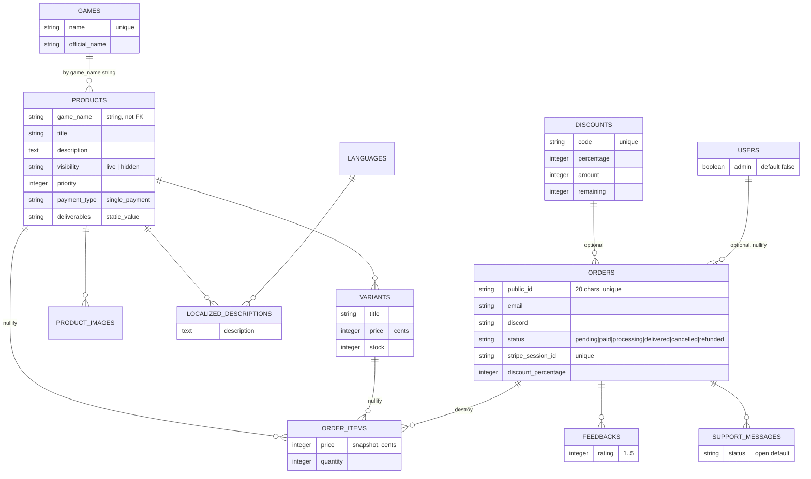

# Database

Schema reference and model rules. Source of truth: `db/schema.rb` (PostgreSQL). Money is in **integer cents**.

## Domain model

> The dashed `GAMES ||--o{ PRODUCTS` relationship is **conceptual** — it's implemented as the `game_name` string column, not an FK.

## Key tables

### `orders`
- `status` default `"pending"`; allowed values validated in `Order`: `pending, paid, processing, delivered, cancelled, refunded`.
- `public_id` — generated in `before_validation` via `SecureRandom.alphanumeric(20).upcase`; unique; used in customer-facing URLs (cancel link, feedback form). The `id` is the internal Stripe `client_reference_id`.
- `stripe_session_id` — unique; the webhook matches on it.
- `discount_id` + `discount_percentage` — snapshot of the discount applied at checkout.
- `user_id` — optional; storefront is userless so usually `NULL`.

### `order_items`
- **Price is a snapshot** of the (discounted) variant price at purchase time — `price` is not derived from the variant later. Changing `variants.price` does not affect past orders.
- `quantity` is always `1` by current design.

### `products` / `variants`
- `products.visibility`: `"live"` (shown on storefront) or `"hidden"` (admin only). Toggled via `ProductsController#product_visibility`.
- `products.priority` — storefront sort order (asc).
- `variants.price` (cents) + `variants.stock`; stock is decremented in the Stripe webhook on payment.

### `discounts`
- `amount` = number of codes to issue; `remaining` = still-redeemable count. `DiscountsController#create` sets `remaining = amount`.
- `percentage` is the discount percent (e.g. `10` = 10% off). **Not validated** (defaults 0).
- `redeem!` returns `false` unless `remaining.positive?`, else decrements `remaining`.

### `users`
- Devise fields only + `admin` boolean (default `false`). No confirmable/lockable/trackable modules.

### `ahoy_visits` / `ahoy_events`
- Standard Ahoy schema. `Ahoy::Visit` geocodes IP on create (skips blank/`127.0.0.1`/`::1`) and writes country/city/region/lat/long.

## Tables with no app code (legacy)

`cart_items` and `wish_lists` exist in the schema but have **no models, controllers, or views** anywhere in `app/`. The README mentions cart/wishlist features, but they are not implemented. Treat them as dead schema — don't assume any cart/wishlist behavior exists. (The only trace is a commented-out line in `product_view_controller.js`.)

## Multi-DB (production)

Production uses **four** Postgres connections from `DATABASE_URL`:
- `primary` — app data
- `cache` — Solid Cache (`db/cache_schema.rb`)
- `queue` — Solid Queue (`db/queue_schema.rb`)
- `cable` — Solid Cable (`db/cable_schema.rb`)

Development/test use the same DB for everything. `bin/docker-entrypoint` loads the `cache`/`queue`/`cable` schemas on boot (errors ignored).

## Migrations & indexes

Indexes worth knowing:
- `orders.public_id` (unique), `orders.stripe_session_id` (unique), `orders.status`, `orders.created_at`
- `discounts.code` (unique)
- `products.game_name`, `products.visibility`, `products.priority`
- `localized_descriptions` unique on `(product_id, language_id)`
- `feedbacks.order_id`, `support_messages.order_id`, `ahoy_*` standard indexes

Run migrations with `bin/rails db:migrate`. Schema is regenerated to `db/schema.rb` automatically; commit it.
