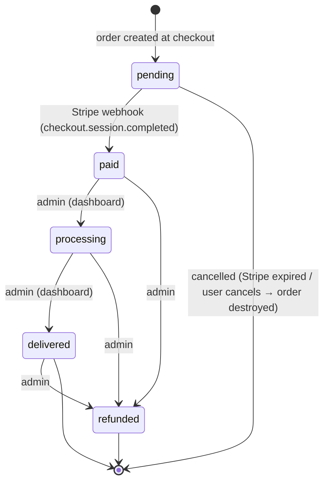
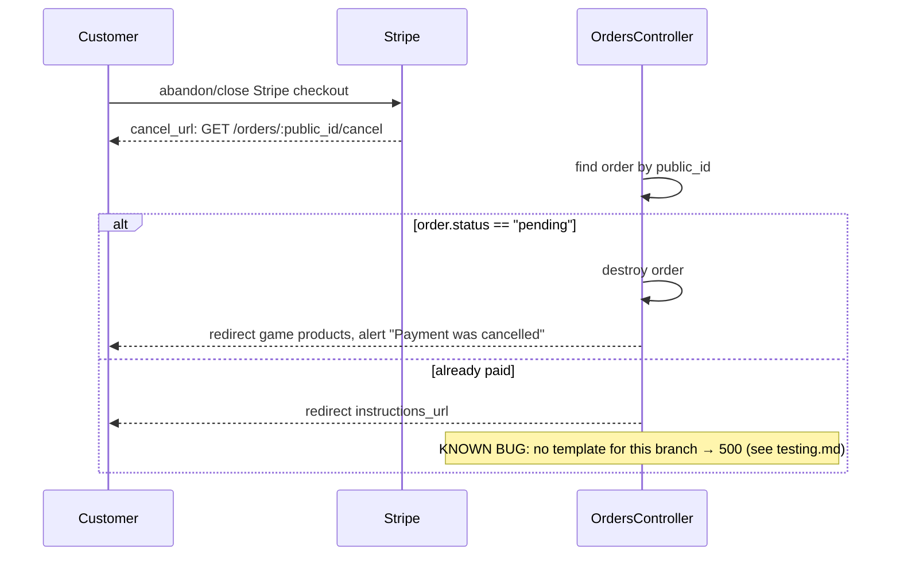
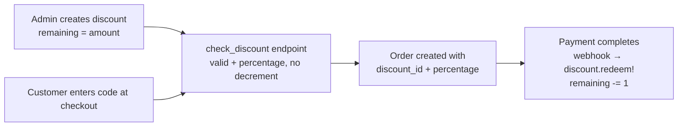

# Flows

The money flows — checkout, payment confirmation, order lifecycle, discounts. These are the parts most worth understanding before touching code.

## Order lifecycle



- `pending` → `paid` happens **only via the Stripe webhook** — never in the controller.
- `processing` / `delivered` / `refunded` / `cancelled` are set by the **admin** from the dashboard (`OrdersController#update`, permitted param `:status`).
- `cancelled` is a manual admin state, distinct from a cancelled Stripe session (which destroys the pending order).

## Checkout flow

```mermaid
sequenceDiagram
    participant U as Customer (browser)
    participant P as ProductsController (storefront)
    participant F as Purchase form + checkout-form Stimulus
    participant O as OrdersController#create
    participant S as Stripe
    participant W as StripeWebhooksController

    U->>P: GET /:game/products/:id
    P-->>U: product page (variant, price, form w/ hidden honeypot field)
    U->>F: click "Buy" (variant, qty=1, email, optional code)
    F-->>O: POST /orders (email, variant_id, quantity, code, contact_me_by_fax_only="")
    O->>O: honeypot_check → params[contact_me_by_fax_only] present? → head :ok (STOP)
    O->>O: validate email regex + variant_id + quantity
    O->>O: set_discount(code) → [discount_id, percentage] (nil/0 if not found)
    O->>O: Order.create!(status=pending) + OrderItem(price = variant.price × (100−pct)/100, rounded)
    O->>S: Stripe::Checkout::Session.create(mode=payment, eur, line_items, success_url=instructions_url, cancel_url=.../orders/:public_id/cancel)
    O->>O: order.update!(stripe_session_id)
    O-->>U: 302 → Stripe hosted checkout
    U->>S: pay with card
    S-->>W: webhook checkout.session.completed
    W->>W: verify signature (STRIPE_WEBHOOK_SECRET)
    W->>W: order = Order.find_by(stripe_session_id) ; skip if already paid?
    W->>W: decrement each variant stock; order.update!(status: "paid")
    W->>W: PurchaseSuccessMailer + ToSelfMailer (deliver_now)
    W->>W: order.discount&.redeem!
    U->>S: success → redirect to success_url (instructions page)
```

Key implementation details (`OrdersController#create`):

1. **Honeypot** — `before_action :honeypot_check` fires first. If the hidden `contact_me_by_fax_only` field is filled (bot), respond `head :ok` and do nothing.
2. **Validation** — email must match `URI::MailTo::EMAIL_REGEXP`, `variant_id` + `quantity` present. `quantity` must be exactly `1` (by design).
3. **Discount** — `set_discount(code)` looks up `Discount.find_by(code:)` and returns `[discount.id, percentage]` or `[nil, 0]`. It does **not** check availability and does **not** decrement anything.
4. **Price** — `OrderItem.price = (variant.price × (100 − percentage) / 100.0).round` (integer cents).
5. **Stripe** — session `mode: "payment"`, currency `eur`, `customer_email`, `client_reference_id: order.id`, `success_url: instructions_url`, `cancel_url: cancel_stripe_checkout_order_url(public_id: order.public_id)`.
6. **Failure** — `rescue Stripe::StripeError` destroys the just-created order and redirects back to the game's products page with the error message.

## Cancel flow



Stripe also sends `checkout.session.expired` — the webhook destroys pending orders for expired sessions as a safety net.

## Stripe webhook

`POST /stripe/webhooks` → `StripeWebhooksController#create` (CSRF skipped, no auth, `require "stripe"`).

1. Read raw body + `HTTP_STRIPE_SIGNATURE` header.
2. `Stripe::Webhook.construct_event(payload, sig, ENV["STRIPE_WEBHOOK_SECRET"])` — returns `400` on `JSON::ParserError` or `Stripe::SignatureVerificationError`.
3. Dispatch on `event.type`:
   - **`checkout.session.completed`**
     - Find order by `stripe_session_id`; return unless found; return if already `paid?` (idempotent).
     - `item.variant.decrement!(:stock, item.quantity)` for each order item.
     - `order.update!(status: "paid")`.
     - Send `PurchaseSuccessMailer.successful_purchase(order)` (customer) and `ToSelfMailer.mail_self(order)` (owner) **synchronously** — `deliver_now`. *(Comment: "Can't use deliver_later; smth goes wrong & it never gets sent.")*
     - `order.discount&.redeem!` — this is the **only place** a discount's `remaining` is decremented.
   - **`checkout.session.expired`**
     - Find order by `stripe_session_id`; if found and still `pending`, destroy it.
4. Always respond `200 "OK"`.

> Only `completed` and `expired` are handled. Other event types are acknowledged and ignored.

## Discounts



- `DiscountsController#check_discount` (`GET /discounts/check_discount?code=`) — public, returns `{valid: true, percentage: n}` if the code exists **and** `available?` (`remaining.positive?`), else `{valid: false}`. Used by the `discount` Stimulus controller to preview the discount on the product page.
- Redemption is **deferred to payment success** — a code that's redeemed-then-cancelled doesn't burn a use, and `remaining` is only decremented once a sale actually completes.
- `redeem!` guards against over-redemption (`return false unless available?`).

## Feedback & support

Both are keyed to orders by the order's **`public_id`** (not the numeric id), which is the only id a customer sees:

- **Feedback**: public `index` (paginated, 10/page), public `new`/`create` (finds `Order.find_by(public_id: params[:feedback][:public_id])`; only `rating` + `feedback` are permitted). One feedback per order (DB-unique on `order_id`). Admin can edit/delete.
- **Support message**: public `new`/`create` (order looked up by `params[:support_message][:public_id]`), admin `index/show/update(status)/destroy`. `destroy` renders nothing (no redirect).

## Admin status updates

`OrdersController#update` (admin only): `order.update!(params.expect(order: [:status]))` → redirects to `dashboard_order_path(order)`. This is how orders move `paid → processing → delivered`.
